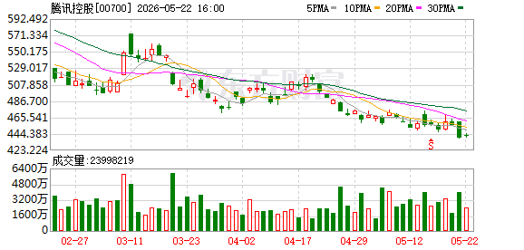

# 📊 腾讯控股 (00700.HK) 股票分析报告

> **分析时间：** 2026年5月23日 13:29 | **当前股价：** 441.40 港元（+0.55%）| **市值：** 约4.02万亿港元

---

## 一、📈 技术面分析

*图1：腾讯控股日K线图（2026年2月-5月），来源：东方财富*

*图2：腾讯控股2026年5月23日分时图，来源：东方财富*

### 1.1 走势概览

从日K线图来看，腾讯控股自2026年2月底触及约574港元的高点后，经历了一轮显著的**趋势性下跌**。3月中旬曾出现强力V型反弹，股价一度修复至前期高位附近，但4月中旬反弹受阻后再度回落。进入5月后，股价开启单边下行，整体重心持续下移，目前处于**明确的空头主导行情**中。

近期最关键的技术信号是5月下旬出现的**带长下影线的锤子线**——最低探至约423港元后强势收回，收盘于441.40港元，表明该价位存在明显买盘承接。这根K线可能是一个短期止跌信号，但仍需后续走势确认。

### 1.2 均线系统

当前股价441.40港元处于**所有主要均线下方**，形成典型的空头排列。各均线数值及状态如下：

| 均线指标 | 数值（港元） | 股价偏离幅度 | 趋势方向 | 状态判断 |
|----------|------------|------------|---------|---------|
| **MA5**（5日均线） | 448.96 | -1.7% | 向下 ↓ | 短期压力，股价运行于下方 |
| **MA20**（20日均线） | 461.06 | -4.5% | 向下 ↓ | 中期压力，持续对股价构成压制 |
| **MA60**（60日均线） | 492.64 | -10.4% | 向下 ↓ | 长期趋势线，股价大幅偏离 |

**均线排列状态：** 空头排列（MA5 < MA20 < MA60，均为下行方向）。短期均线在下方，长期均线在上方，且均向下运行，这是最典型的**空头压制形态**。股价需要先后突破MA5和MA20才能初步扭转颓势，短期内反弹空间受限。

从日K线图看，股价自4月中旬以来始终未能有效站上5日均线，说明短期空方动能持续占优。20日均线的压制更为明显——4月中旬的反弹正是在20日均线附近遇阻回落，该位置（约460-470港元区域）是当前最核心的技术阻力带。

### 1.3 支撑与压力

| 类型 | 价位区间（港元） | 依据 |
|------|-----------------|------|
| 🟢 **短期支撑位** | 423 - 430 | 近期K线下影线触及低点，前期整理平台下沿 |
| 🟢 **强支撑位** | 400 | 整数心理关口，历史重要成交密集区 |
| 🔴 **第一压力位** | 448 - 450 | MA5均线附近，短期反弹第一目标 |
| 🔴 **中期压力位** | 460 - 470 | MA20均线区域，4月反弹见顶位置 |
| 🔴 **强压力位** | 490 - 500 | MA60均线及前期密集成交区，中期趋势翻转关键 |

**详细分析：**

**支撑方面，** 423-430港元区间是当前最重要的多头防线。本次探底产生的长下影线说明该位置有强买盘进驻，如果后续不再跌破此区间，可能形成"双底雏形"的右腿。但若423失守，400港元整数关口将是下一个潜在支撑，该位置也是重要的心理节点和前期平台低点区域。

**压力方面，** 短期内MA5（448.96港元）就是第一道坎。即便突破MA5，MA20（461.06港元）才是真正考验——4月中旬的反弹正是在该区域（约460-470港元）遇阻回落，证明该位置积聚了大量套牢盘和空方卖压。在没有显著放量的配合下，仅靠超跌反弹很难一次性突破该区域。

### 1.4 今日分时解读

从5月23日分时图观察，今日走势呈现**高开后宽幅震荡、微涨收盘**的特征：

- **开盘阶段（09:30-10:00）：** 高开于约441.80港元，随即快速拉升，早盘即触及日内高点约444.80港元，逼近445港元整数关口。多头在开盘阶段表现得较为积极。
- **上午回调（10:00-11:30）：** 冲高后遭遇抛压，股价大幅回落，一度翻绿跌破昨日收盘价（439.00港元），最低探至约437.80港元。日内振幅约7港元，说明高位兑现压力不容小觑。
- **午后反弹（13:00-14:00）：** 午后开盘后资金承接力增强，股价再度拉升至高位区域，形成二次探顶格局，但未能突破早盘高点。
- **尾盘回落（14:00-16:00）：** 股价未能守住午后涨幅，尾盘震荡下行，最终收于约441.40港元，略高于昨日收盘价439.00港元。

**量价配合分析：** 整体来看，今日量比仅0.81，处于缩量状态。盘中的拉升段缺乏成交量配合，显示增量资金入场意愿不强；而冲高回落过程中也未见恐慌性抛售，表明当前市场处于**存量博弈、多空拉锯**的格局。尾盘的小幅回落略偏空，暗示多方力量有所衰减。

### 1.5 关键技术信号总结

| 指标 | 当前值/状态 | 含义 |
|------|-----------|------|
| **均线系统** | 空头排列（MA5<MA20<MA60） | 🔴 看空——中期趋势向下 |
| **MACD** | 柱值 -0.5486，较前值（-0.3471）扩大 | 🔴 看空——空头动能仍在增强 |
| **RSI(14)** | 36.3 | 🟡 中性偏弱——接近超卖区但未触及（<30） |
| **成交量** | 量比 0.81，持续缩量 | 🟡 中性——杀跌动能减弱，但多方也未发力 |
| **K线形态** | 近期出现锤子线（长下影线） | 🟢 短线看多——低位买盘出现 |
| **主力资金** | 5月22日主力净流入4.04亿港元 | 🟢 短线偏多——主力试探性介入 |

**技术面总体评级：** 短期超跌反弹信号出现（锤子线+主力小幅净流入），但中期空头趋势未改。属于**"短期看反弹、中期仍谨慎"**的技术格局。关键观察点在于股价能否在423-430区间构筑有效支撑并放量站回MA5以上。

---

## 二、💰 基本面分析

### 2.1 核心估值数据

| 指标 | 数值 | 说明 |
|------|------|------|
| **当前股价** | 441.40 港元 | 2026年5月23日盘中价 |
| **市净率（P/B）** | 3.15 倍 | 处于互联网龙头合理区间 |
| **总市值** | 约4.02万亿港元 | 港股市值第一权重股 |
| **52周最高（盘中）** | 约574 港元 | 2月底触及的高点 |
| **52周最低（近期）** | 约423 港元 | 5月下旬盘中低点 |
| **距离52周高点跌幅** | -23.1% | 已进入技术性调整区间 |

### 2.2 关键解读

> **核心判断：** 腾讯控股股价从574港元高点回落至当前441港元，累计跌幅超过23%，已进入深度调整。从估值角度看，P/B 3.15倍处于历史相对低位区间，长期配置价值逐步显现。但短期缺乏明确的业绩催化剂和资金驱动，基本面与股价之间存在"价值显现但缺乏催化剂"的阶段性矛盾。

当前下跌行情更多由技术面和市场情绪主导，而非基本面恶化。作为港股市值第一权重股，腾讯的经营基本盘——社交（微信/QQ）、游戏、金融科技与企业服务——依然稳固。但市场对宏观环境的不确定性以及缺乏新的增长故事存在担忧，导致估值承压。

### 2.3 业绩与行业对比

> **说明：** 本次数据采集未拉取到腾讯控股最新的季度财报明细数据。上述估值判断基于公开价格数据和历史估值区间进行分析。建议投资者自行补充2026年Q1最新财报数据（收入增速、Non-IFRS净利润、各业务板块增速）以完善基本面分析。

从行业视角看，中国互联网板块在2025-2026年整体表现分化。腾讯作为综合型平台巨头，相比纯游戏或纯电商公司，具备更强的抗周期性。当前市场给予的估值折价更多来自系统性风险因素，而非公司个体经营问题。

### 2.4 基本面与股价背离分析

存在一定程度的"基本面-股价背离"：
- **股价层面：** 自2月高点回撤超23%，技术面全面转空，市场弥漫悲观情绪
- **基本面层面：** 经营基本盘未出现实质性恶化，社交护城河牢固，P/B估值处于历史中低位
- **背离原因：** 市场情绪驱动的超调 + 宏观不确定性折价 + 缺乏短期催化剂

这种背离往往为中长期投资者提供了左侧布局窗口，但短期趋势交易者需要关注技术面的确认信号。

---

## 三、💵 资金流向分析

### 3.1 主力资金动向

| 日期 | 主力净流入（港元） | 散户净流入（港元） | 方向 |
|------|-------------------|-------------------|------|
| 2026-05-22 | +4.04亿 | +4.10亿 | 🟢 主力与散户同步净流入 |

**累计统计：** 最近1个交易日主力净流入合计 **4.04亿港元**，连续净流入 **1天**。

### 3.2 资金面分析

5月22日的数据显示主力资金出现**净流入4.04亿港元**，这是近期资金面的积极信号。有趣的是，当日散户资金也同步净流入4.10亿港元，出现了"主力与散户同步买入"的格局。这种共振通常发生在股价已经历较大幅度调整之后，主流资金和散户同时认为当前价位具备吸引力。

不过需要警惕的是，仅1天的资金流入还不足以确认趋势反转。历史数据显示，单一交易日的主力流入在空头行情中往往对应"抄底资金试探"，后续可能面临二次确认或止损出局的波动。持续观察主力资金能否**连续3-5个交易日净流入**，是判断资金面是否完成筑底的关键指标。

---

## 四、📰 近期关键事件时间线

> **说明：** 本次数据采集中，东方财富API返回的研报列表内的报告均非腾讯控股相关（涉及机器人、军工、化工、化肥等行业的其他上市公司）。短期内无针对腾讯控股的重大公开事件或内部变动信息。该阶段股价波动主要由市场整体情绪和技术面驱动，而非单一事件催化。

建议投资者关注后续可能的催化剂：Q1财报发布（如有）、游戏版号审批动态、微信生态商业化进展、以及港股通资金流向变化。

---

*═══ 以上是证据和数据，以下是基于证据的判断 ═══*

## 五、🔮 综合判断

### 总评级：🟡 短期谨慎偏多，中期维持观望

**一句话总结：** 技术面出现超跌反弹信号（锤子线+主力试探性流入），但中期空头趋势尚未扭转，当前属于"反弹博弈"窗口而非"趋势翻转"节点。风险等级：**中等偏高。**

---

### 5.1 🟢 看涨因素

1. **锤子线止跌信号** → 日K线图上近期出现的带长下影线的锤子线，最低触及423港元后强势收回至441港元，这是经典的**技术性止跌反转信号**。下影线长度远大于实体，说明423港元附近存在强烈的买盘承接。如果次日收阳确认，该形态的有效性将大幅提升。

2. **RSI接近超卖区（36.3）** → 14日RSI为36.3，虽然尚未进入30以下的超卖区间，但已处于偏低位置。在持续下跌过程中，RSI未创出新低（相较价格低点的RSI表现），暗示下跌动能可能正在衰竭。一旦RSI跌入30以下并出现钝化后反弹，将是更强力的买入信号。

3. **主力资金试探性流入** → 5月22日主力净流入4.04亿港元，虽然金额不大且仅持续1天，但在连续下跌后出现主力资金转向，往往是大资金左侧布局的先兆。

4. **估值回归合理区间** → 从574港元高点回落23%后，P/B已降至3.15倍，处于历史相对低位。对于基本面稳固的万亿市值龙头而言，深度调整后的估值优势逐步显现，中长期配置性价比提升。

5. **量价背离初现——缩量下跌** → 5月下跌过程中成交量持续萎缩（量比仅0.81），说明抛售动能正在衰减，"地量见地价"的规律如果成立，当前可能接近阶段性底部区域。

---

### 5.2 🔴 看跌因素

1. **均线系统完全空头排列** → MA5（448.96）< MA20（461.06）< MA60（492.64），且均向下运行，是最典型的空头趋势结构。历史上类似的均线空头排列格局一旦形成，通常需要较长时间（数周至数月）才能修复。均线将成为反弹过程中层层阻力。

2. **MACD空头动能持续增强** → MACD柱值从-0.3471扩大至-0.5486，差值扩大58%，说明空头动能仍在加速释放中。DIF与DEA线可能处于零轴下发散状态，尚未出现收敛或金叉信号。MACD的改善需要时间，短期内反转概率较低。

3. **上方套牢盘压力沉重** → 460-470港元区域（MA20附近）是4月反弹高点，该位置上方积累了大量的套牢盘。每次反弹触及该区域都可能激发解套盘涌出，形成强阻力。仅凭超跌反弹难以一次性突破。

4. **缺乏明确的短期催化剂** → 短期内没有发现腾讯控股相关的重大利好事件（新游戏发布、业绩超预期、回购计划等）。没有催化剂支撑的反弹往往是"弱反弹"，容易冲高回落。

5. **大盘环境不确定** → 作为港股第一大权重，腾讯的走势与恒生指数高度相关。如果港股整体环境偏弱，腾讯很难走出独立行情。宏观层面的不确定性（利率政策、地缘风险等）仍是潜在风险因素。

---

### 5.3 操作建议

| 投资者类型 | 建议策略 | 仓位建议 | 止损/止盈参考 |
|-----------|---------|---------|-------------|
| **短线交易者** | 可在423-430区间轻仓试探做反弹，快进快出 | 1-2成 | 止损420，止盈MA20附近（460-470） |
| **中线投资者** | 观望为主，等待站上MA20再考虑介入 | 持仓者可设好止损继续持有 | 关键观察MA20突破信号 |
| **长线价值投资者** | 当前估值具备左侧布局价值，可分批建仓 | 分3-5批，每跌5%-8%加仓 | 不需要止损，关注基本面变化 |

> **A/H对比：** 腾讯控股仅在港交所上市，无A股直接可比标的。投资者可参考恒生科技指数走势和南向资金流向作为辅助参考。

---

## 六、🎯 翻转条件

### 向上翻转 🟢（看多确认信号）

| 触发条件 | 观察标准 | 逻辑说明 |
|---------|---------|---------|
| 放量站上MA5（449港元） | 成交量放大至1.5倍以上 | 短期趋势翻多第一步 |
| 突破MA20（461港元）并站稳3天 | 收盘价连续3日高于MA20 | 中期趋势转多确认 |
| MACD金叉形成 | DIF上穿DEA | 空头动能衰竭信号 |
| 主力连续3-5日净流入 | 累计净流入>10亿港元 | 资金面筑底完成 |
| 出现明确利好催化 | 业绩超预期/回购/政策利好 | 提供基本面支撑 |

### 向下翻转 🔴（继续看空确认）

| 触发条件 | 观察标准 | 逻辑说明 |
|---------|---------|---------|
| 跌破423港元支撑位 | 收盘价低于423且次日无法收回 | 双底形态失败，下跌加速 |
| 反弹触碰MA20后再度回落 | 反弹至460-470后放量下跌 | 确认MA20为强阻力，逢高减仓 |
| MACD绿柱进一步放大 | 柱值持续扩大，DIF加速下行 | 空头动能未衰竭 |
| 主力资金重新大幅流出 | 单日主力净流出>5亿港元 | 资金面恶化 |
| 大盘系统性风险爆发 | 恒生指数跌破关键支撑 | 权重股无法独善其身 |

---

## 七、📋 风险提示 / 免责声明

⚠️ **本报告由AI生成，仅供参考，不构成投资建议。** 股市有风险，投资需谨慎。本报告中的技术分析和数据均来源于公开信息，可能存在数据延迟或误差。任何投资决策应基于投资者自身的风险承受能力和判断，必要时请咨询专业投资顾问。

**主要风险提示：**
- 技术分析具有滞后性和概率性，历史走势不代表未来表现
- 空头排列行情中存在"接飞刀"风险——反弹可能演变为下跌中继
- 全球宏观环境和政策变化可能对港股市场产生重大影响
- 腾讯控股作为大盘权重股，受恒生指数系统性风险影响较大
- 本次分析中部分财务数据未能完整获取，基本面判断存在信息不充分的局限性

---

*报告生成时间：2026年5月23日 | 数据来源：东方财富API | 分析工具：AI股票分析系统*
