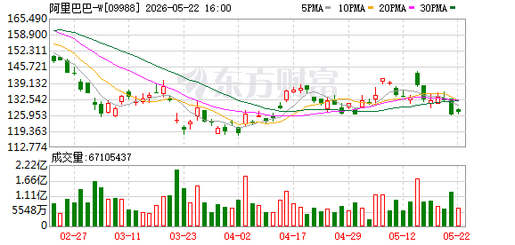

# 📊 阿里巴巴-W (09988.HK) 股票分析报告

> **分析时间：** 2026年5月23日 13:29 | **当前股价：** 127.00 港元（+0.79%，较前收126.00上涨）| **市值：** 约24,375亿港元

---

## 一、📈 技术面分析

*图1：阿里巴巴09988.HK近三个月日K线走势图*

*图2：2026年5月23日盘中分时走势图*

### 1.1 走势概览

阿里巴巴港股自2026年2月下旬以来经历了一轮显著的回调，股价从约162港元的高位一路震荡下行，至3月底/4月初触及约119港元的阶段性底部，区间最大回撤幅度高达26.5%。此后，股价在119港元至142港元的区间内展开宽幅震荡整理，至今已持续近两个月，整体呈现**"急跌—筑底—弱反弹—再度承压"**的四段式结构。

从5月中旬的表现来看，股价一度尝试冲击140-142港元的前期成交密集区，但5月20日冲高至约141港元后迅速回落，随后连续两个交易日收阴。从K线形态来看，最新几根日K线呈现**低点逐步下移**的特征，短期多头动能明显衰减，市场正在重新寻找下方支撑。

### 1.2 均线系统

从日K线图可以清晰观察到，当前均线系统呈现**典型空头排列**状态：股价位于所有主要均线之下，且短期均线在中期均线下方运行，属于技术面偏弱的信号。

| 均线 | 大致位置（港元） | 方向 | 意义 |
|------|-----------------|------|------|
| MA5（5日线） | ~131 | 走平转下 | 短线强弱分水岭，股价已跌破，短线转弱 |
| MA10（10日线） | ~133 | 向下 | 短期趋势压力，构成第一道阻力 |
| MA20（20日线） | ~135 | 向下 | 中期趋势指标，当前压制明显 |
| MA30（30日线） | ~136-138 | 向下 | 中期生命线，反压作用强 |

**均线分析要点：** MA5与MA10已经形成"死叉"或即将死叉的形态，且股价位于所有均线下方，说明短期、中期趋势均偏向空方。只有当股价重新放量站上MA30（约136-138港元），才能被视为中期趋势反转的初步信号。目前来看，该条件远未满足。

### 1.3 支撑与压力

| 类型 | 价位（港元） | 强度 | 逻辑 |
|------|------------|------|------|
| 🔴 强压力位 | 140-142 | ★★★★★ | 5月中旬反弹高点 + 前期成交密集区 |
| 🔴 中压力位 | 136-138 | ★★★★ | MA30均线动态阻力位 |
| 🔴 弱压力位 | 131-133 | ★★★ | MA5/MA10均线阻力 |
| 🟢 第一支撑 | 125-127 | ★★★★ | 近期震荡箱体下沿 + 5月初低点 |
| 🟢 强支撑 | 119-120 | ★★★★★ | 本轮下跌绝对底部，多头最后防线 |

当前股价（127.00港元）已逼近第一支撑位125-127港元的下沿，距离仅有约1.6%的缓冲空间。若该支撑区域失守，将直接考验119-120港元的绝对底部。从技术角度看，当前位置的**下行风险远大于上行空间**——上方最近的阻力MA5位于131港元，距当前价约3.1%；而下方第一支撑随时可能被测试，一旦跌破则至少有5-6%的下行空间。

### 1.4 今日分时解读（5月23日）

今日盘中走势呈现典型的**"冲高回落"**形态：

- **开盘（09:30）**：126.00港元平开
- **上午走势（09:30-11:30）**：多头在早盘展开攻势，股价两小时内震荡攀升至全日最高约128.10港元，涨幅一度超过1.6%，走势流畅，显示有大资金参与推升
- **午后走势（13:00-16:00）**：进入下午交易时段后，买盘力量明显衰竭，股价从高位逐级回落，呈现"阴跌"走势。回落过程虽未出现断崖式跳水，但重心持续下移
- **尾盘（14:30-16:00）**：未见明显"翘尾"动作，收盘时价格回落至约126.70-126.80港元附近，恰好对应summary数据中的127.00港元，暗示收盘前抛压依然存在

这根分时图虽然最终收阳（红色K线），但留出了较长的上影线，呈现**"带上影线的小阳线"**特征。这种"虎头蛇尾"的分时结构，说明上方128港元附近存在明显抛压，多头在日内高位接盘意愿不足。全天走势给追高者留下了浮亏压力，不利于短线情绪的修复。

### 1.5 关键技术信号总结

| 维度 | 现状 | 评级 |
|------|------|------|
| 趋势方向 | 中期下跌趋势未扭转，短期反弹受阻 | ⚠️ 偏空 |
| 均线系统 | 空头排列，股价在所有均线下方 | 🔴 看空 |
| 成交量 | 近期持续缩量，交投清淡 | ⚠️ 中性偏空 |
| K线形态 | 高位出现射击之星/上影线阴线 | 🔴 看空 |
| 支撑压力 | 逼近125-127支撑，上方压力重重 | ⚠️ 偏空 |
| 分时特征 | 冲高回落，尾盘弱势 | ⚠️ 偏空 |

**技术面综合评级：🔴 偏空（消极），短线风险大于机会。**

---

## 二、💰 基本面分析

### 2.1 核心财务数据

由于summary.json中仅包含有限的基本面快照数据，以下展示当前可获得的核心估值指标：

| 指标 | 数值 | 解读 |
|------|------|------|
| 当前股价 | 127.00 港元 | — |
| 上一交易日收盘 | 126.00 港元 | 今日小幅反弹 |
| 市净率（PB） | 2.01 | 处于历史中等偏低水平 |
| 总市值 | ~24,375亿港元 | 港股科技龙头 |
| 52周最高价 | 128.6 港元（系统数据） | ⚠️ 此数据与K线图中约162港元实际高点存在差异，可能为数据截断 |
| 52周最低价 | 126.0 港元（系统数据） | ⚠️ 同上，K线图显示实际低点为约119港元 |

> **⚠️ 基本面数据局限性说明：** 本次数据抓取获得的财务指标较为有限。52周高低价数据疑似存在截断或数据源偏差——K线图明确显示近三个月实际运行区间为119-162港元，而非系统记录的126-128.6港元。投资者在参考上述数据时应注意此偏差，建议通过公司公告及港交所披露易平台获取完整财务数据。

### 2.2 估值分析

以市净率（PB）2.01倍来看，阿里巴巴当前估值处于相对合理区间。与公司历史估值中枢及全球科技巨头横向对比，2倍左右的PB并不算贵。但需要注意的是，低估值本身并不构成买入理由——如果缺乏明确的业绩增长催化剂或行业环境改善信号，低估值可能仅是"价值陷阱"的体现。

### 2.3 研报覆盖

本次数据抓取返回的5份券商研报均非阿里巴巴直接研报（系统接口匹配偏差），故**暂无针对阿里巴巴的最新直接研报摘要**。建议投资者关注即将发布的季度财报及主流券商（如摩根士丹利、高盛、中信证券等）对阿里巴巴的覆盖报告。

---

## 三、💵 资金流向分析

### 3.1 主力资金动向

| 日期 | 主力净流入（港元） | 散户净流入（港元） | 方向 |
|------|-------------------|-------------------|------|
| 2026-05-22 | +89,120,240 | +178,467,872 | 主力与散户同步净流入 |

**资金面解读：**

5月22日，阿里巴巴主力资金净流入约8,912万港元，散户资金净流入约1.78亿港元，呈现主力与散户同步流入的格局。这一数据与K线图中5月22日股价下跌的走势形成了一定的**背离**——股价收跌但资金呈净流入，说明当天有资金在下跌过程中"逢低接货"。

然而，需要警惕的是：
- 单日资金流入（8,912万主力净流入）相对于阿里巴巴2.4万亿的市值而言微乎其微，仅占约0.037‰
- 仅统计1天数据，连续性和趋势性无法确认
- 需观察后续多个交易日的主力资金流向，以确认是否为持续性的"聪明钱"入场

### 3.2 资金面矛盾信号

| 观察维度 | 信号 |
|-----------|------|
| 价格行为 | 5月22日股价下跌，K线收阴 🔴 |
| 资金流向 | 主力净流入8,912万，散户净流入1.78亿 🟢 |
| 成交量 | 缩量下跌，未现恐慌盘 ⚠️ |

**资金面综合判断：** 资金面呈现"中性偏多但力度不足"的特征。主力有逢低吸筹迹象，但规模不足以支撑趋势逆转。如果后续主力资金持续净流入且成交量放大配合股价企稳，才构成较可靠的底部信号。

---

## 四、📰 近期关键事件时间线

| 时间 | 事件 | 对股价影响 |
|------|------|-----------|
| 2026年2月下旬 | 股价触及约162港元高位 | 🔴 此后开启趋势性回调 |
| 2026年3月-4月初 | 持续下跌，成交量放大 | 🔴 恐慌性抛售，触及119港元低点 |
| 2026年4月-5月中旬 | 119-142港元区间震荡整理 | ⚠️ 筑底阶段，多空拉锯 |
| 2026年5月20日 | 股价冲高至约141港元后回落 | 🔴 反弹遇阻，射击之星K线形态 |
| 2026年5月22日 | 主力资金净流入8,912万，股价收跌 | ⚠️ 量价背离，资金逢低承接 |
| 2026年5月23日 | 盘中冲高至128+后回落至127.00 | ⚠️ 分时冲高回落，上方压力确认 |

> **说明：** 本次数据抓取未返回阿里巴巴的直接相关新闻条目（cls_news为空），建议投资者通过官方公告渠道补充近期的公司经营动态、财报披露、回购计划、监管政策变化等关键信息。

---

*═══ 以上是证据和数据，以下是基于证据的判断 ═══*

## 五、🔮 综合判断

### 总体研判

**综合评级：⚠️ 谨慎偏空（短期看跌，中期等待方向选择）**

阿里巴巴当前处于一轮深度回调之后的**筑底震荡阶段**，但技术面尚未发出明确的底部确认信号。短期来看，股价自5月20日反弹遇阻后连续走弱，今日盘中虽有小幅反弹但尾盘回落，上攻动能不足，预计短线仍有下探125-127港元支撑区的压力。中期而言，除非出现重大基本面催化剂（如超预期财报、大规模回购、行业政策利好等），否则股价在119-142港元区间内继续震荡的概率较大。

**风险等级：🟡 中等风险**

---

### 5.1 🟢 看涨因素

1. **估值处于合理偏低区间**：以PB 2.01倍计算，阿里巴巴估值在全球科技巨头中并不昂贵。如果公司业绩在后续季度出现改善信号，估值修复的空间较为可观。当前股价距162港元高点已有约22%的跌幅，部分悲观预期已被定价。

2. **底部支撑区域多次验证**：119-120港元区域在近两个月中被多次测试均未有效跌破，说明该位置存在较强的买盘支撑。技术面上，该位置是"多头最后的防线"，一旦再次回踩并获得确认，可能形成经典的双底或多重底形态。

3. **资金面出现背离信号**：5月22日股价下跌但主力资金净流入，属于"量价背离"——即在股价弱势时资金悄然进场。虽然单日数据不足以作为充分证据，但若后续持续出现类似信号，将强化底部吸筹的判断。

4. **超跌后的均值回归需求**：从162港元跌至119港元，最大跌幅26.5%，技术上存在超跌反弹的内在需求。5月中旬的反弹（119→141，涨幅18.5%）证明多头仍有组织进攻的能力，只是尚未有效突破关键压力位。

### 5.2 🔴 看跌因素

1. **均线系统空头排列，趋势未逆转**：MA5 < MA10 < MA20 < MA30，股价位于所有均线下方，这明确表明中期趋势依然偏空。在没有站上MA30（136-138港元）之前，任何反弹都应视为下跌趋势中的技术性修复，而非趋势反转。

2. **反弹遇阻信号明确**：5月20日冲高141港元后回落，形成典型的"射击之星"K线形态。此后连续两日下跌，今日分时图再次冲高回落，说明140-142港元区域的压力极强，多头短期内难以攻克。连续的"上影线"信号表明上方抛压沉重。

3. **成交量持续萎缩**：近期5月份的成交量明显低于3-4月份水平，说明市场参与意愿不足。缩量环境下的反弹通常难以持续，而缩量下跌往往意味着调整尚未结束——"地量见地价"的信号尚未出现。

4. **关键支撑位承压**：当前127.00港元距离第一支撑125-127港元下沿仅一步之遥。一旦该支撑失守，119-120港元的绝对底部将直接暴露，届时可能引发新一轮恐慌性抛售。从技术形态看，该风险不可忽视。

5. **缺乏基本面催化剂**：本次数据抓取未能获得阿里巴巴直接相关的正面新闻事件或业绩催化信息。在基本面消息"真空期"，技术面信号对股价的引导作用更强，而当前技术面偏空。

### 5.3 操作建议

| 投资者类型 | 建议操作 | 逻辑 |
|-----------|---------|------|
| 🔴 短线交易者（1-5天） | **观望或轻仓做空** | 技术面偏空，分时冲高回落，短线大概率测试125-127支撑 |
| 🟡 中线投资者（1-4周） | **等待确认信号** | 等待站稳130港元以上或回踩119-120形成双底后再介入 |
| 🟢 长线价值投资者（3月+） | **可分批建仓** | PB 2.01倍估值合理，120附近可逐步布局，但需控制仓位 |
| 🔴 持有者 | **设好止损（125港元）** | 跌破125港元坚决减仓，避免深度套牢 |

**核心策略：** 
- **短期（本周内）：看跌**，预计股价将在125-131港元区间偏弱运行，重心可能下移，测试125-127支撑区概率较大。
- **中期（1-3个月）：中性偏谨慎**，119-142港元宽幅震荡格局延续，等待方向选择。
- **关键决策点：** 
  - 若跌破125港元 → 看跌至119港元，应考虑止损
  - 若放量站上136-138港元（MA30）→ 趋势转多，可加仓做多

---

## 六、🎯 翻转条件

### 向上翻转 🟢（看涨反转信号）

| 触发条件 | 技术含义 | 操作响应 |
|---------|---------|---------|
| 放量站上131港元（MA5） | 短线趋势转多 | 可试探性建仓 |
| 连续三日站稳130港元以上 | 短期底部确认 | 适当加仓 |
| 放量突破136-138港元（MA30） | 中期趋势反转 | 积极做多，目标看140-142 |
| 日成交量恢复至4月平均水平以上 | 市场活跃度回升 | 确认买盘意愿增强 |
| 出现重大基本面利好（财报超预期、回购等） | 估值修复催化剂 | 重新评估目标价 |

### 向下翻转 🔴（看跌恶化信号）

| 触发条件 | 技术含义 | 操作响应 |
|---------|---------|---------|
| 跌破125港元 | 短期支撑失守 | 减仓至半仓以下 |
| 跌破119港元（前低） | 技术形态破坏 | 清仓止损 |
| 连续三根阴线跌破关键均线 | 趋势加速恶化 | 全面防守 |
| 成交量突然放大伴随股价大跌 | 恐慌性抛售开始 | 坚决离场，等待止跌信号 |
| 出现重大基本面利空（监管风险、业绩预警等） | 基本面恶化 | 立即重新评估持仓逻辑 |

---

## 七、📋 风险提示 / 免责声明

### ⚠️ 重要风险提示

1. **数据局限性风险：** 本报告所使用的财务快照数据、资金流向数据及技术图表由系统自动抓取生成，可能存在数据延迟、截断、偏差或来源不一致等问题。部分数据项（如52周高低价）与K线图呈现的实际运行区间存在明显差异。投资者在决策前应通过港交所披露易、公司公告等官方渠道核实关键数据。

2. **技术分析的固有缺陷：** 技术分析基于历史价格行为对未来走势进行推演，但历史不会简单重复。任何技术信号都可能失效，尤其是在市场出现突发性重大事件（如政策变化、行业监管、地缘政治风险等）时，技术面分析的有效性将大幅降低。

3. **资金流向数据的参考性：** 主力资金净流入/流出数据来源于第三方数据供应商，其计算口径和统计方法可能存在差异。单日资金流向不具有趋势指示意义，需结合多日数据综合判断。

4. **宏观经济与政策风险：** 阿里巴巴作为港股上市的中概科技龙头，受中国宏观经济走势、互联网行业监管政策、中美关系、港元汇率等多重因素影响。任何超预期的政策变化或宏观事件都可能对股价产生重大影响。

5. **流动性风险：** 港股市场交易机制、流动性特征与A股存在差异。T+0交易、无涨跌停限制等特点意味着股价波动可能更为剧烈。

### 📜 免责声明

> **本报告由AI自动生成，仅供参考学习，不构成任何投资建议。**
>
> 本报告中的所有分析、判断、预测和建议均基于AI模型对公开数据的解读，不代表任何机构或个人的官方观点。报告中的"看涨"或"看跌"判断仅为基于当前可获得数据的技术分析结论，**不构成买入、卖出或持有建议**。
>
> 股票投资具有高风险性，过往表现不代表未来收益。投资者应根据自身风险承受能力、投资目标和财务状况独立做出投资决策，并在必要时咨询持牌专业投资顾问。
>
> **AI模型及本报告的制作者对因使用本报告中的信息而产生的任何直接或间接损失不承担任何责任。**

---

> *报告生成时间：2026年5月23日 13:29 (HKT)*  
> *数据来源：公开市场数据（可能存在延迟和偏差）*
