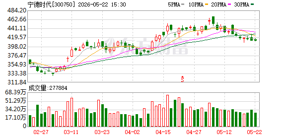

# 📊 宁德时代 (300750.SZ) 股票分析报告

> **分析时间：** 2026年5月23日 13:30 | **当前股价：** 411.16元（-0.11%）| **市值：** 约1.90万亿 | **市盈率(TTM)：** 22.93

---

## 一、📈 技术面分析

*图1：宁德时代日K线图（2026年2月底–5月22日）*

*图2：宁德时代分时走势图（最近交易日）*

### 1.1 走势概览

宁德时代自2026年2月底以来，经历了一轮完整的 **"主升浪—高位见顶—回调盘整"** 波段：

- **2月底至4月中旬（主升浪）：** 股价从约340元一路攀升至472元附近的历史高位，涨幅约38%。该阶段成交量持续放大，量价配合良好，资金参与度高。
- **4月中下旬（见顶回落）：** 在472元一线出现带长上影线的K线形态，随后股价重心开始下移，高位抛压明显。
- **5月以来（阴跌盘整）：** 股价已从高点回落约13%，当前在410–420元区间窄幅震荡。近期成交量明显萎缩至约27.7万手，远低于主升浪时期的50万手以上水平，市场进入观望期。

**整体判断：** 长期上升趋势尚未被彻底破坏，但短期技术面已明显转弱，目前处于"中期调整蓄势"阶段。

### 1.2 均线系统

| 均线 | 估算数值 | 趋势方向 | 股价相对位置 |
|------|---------|---------|------------|
| MA5（5日） | ~423元 | 向下 | 股价在下方，短期承压 |
| MA10（10日） | ~430元 | 向下拐头 | 关键短期压力位 |
| MA20（20日） | ~435元 | 走平 | 中期均线压力 |
| MA30（30日） | ~425元 | 走平 | 关键多空分水岭 |

**均线排列分析：** 均线系统已从此前的多头排列（MA5>MA10>MA20>MA30）转变为**空头排列雏形**（MA5下穿MA10），这是经典的技术面转弱信号。股价当前在MA30（~425元）下方运行，若短期内无法有效收复，则中期调整大概率延续。

### 1.3 支撑与压力

| 类别 | 价位区间 | 说明 |
|------|---------|------|
| 🔴 强压力位 | 470–472元 | 前历史高点，大量套牢盘 |
| 🟡 中等压力位 | 435–440元 | MA20 + 前期密集成交平台 |
| 🟡 近端压力位 | 428–430元 | MA10（10日均线） |
| 🟢 第一支撑位 | 409–415元 | 近期低点区域，正在测试 |
| 🟢 强支撑位 | 400元整数关口 | 心理支撑 + 技术支撑 |
| 🟢 终极支撑位 | 380–390元 | 前期缺口及起涨平台 |

**技术面核心观点：** 当前股价411元恰好处于第一支撑位的下沿，距离强支撑400元仅约2.7%的距离。若400元整数关口能形成有效支撑并伴随放量反弹，则中期调整有望结束；若有效跌破400元，则调整空间进一步打开。

### 1.4 今日分时解读

最近交易日的分时图呈现出典型的 **"冲高回落 + 尾盘跳水"** 弱势结构：

- **开盘：** 约414.00元，平开或微幅低开，无明显方向性。
- **上午走势：** 围绕昨日收盘价窄幅震荡，波动极低，多空双方均无主导力量。
- **午后拉升：** 13:30前后出现一波拉升，最高触及约416.80元，但随后迅速回落——这是一次典型的"诱多"走势，跟风盘不足。
- **尾盘跳水：** 14:50之后，股价以近45度角单边下跌，最低探至约409.00元，收于全天低位。
- **均价线关系：** 白线（实时价格）全天大部分时间运行在黄线（均价线）下方，说明当日参与买入的资金大多处于浮亏状态，空头牢牢掌握主动。

**分时结论：** "光脚阴线"式的尾盘跳水是极弱信号，通常预示着次日早盘仍有惯性下探。投资者需警惕短期继续调整的风险。

### 1.5 关键技术信号总结

| 信号 | 判断 | 强度 |
|------|------|------|
| 短期趋势 | MA5下穿MA10，空头排列 | ⚠️ 偏空 |
| 成交量 | 持续缩量，观望情绪浓厚 | 🔶 中性偏空 |
| MACD（推断） | 零轴上方死叉，动能减弱 | ⚠️ 偏空 |
| K线形态 | 近期连续小阴小阳，实体较短 | 🔶 方向不明 |
| 分时结构 | 尾盘跳水，光脚阴线 | ❌ 短期看空 |
| 支撑距离 | 距400元强支撑仅2.7% | 🟢 下行空间有限 |

**技术面综合评级：短期偏空（⭐⭐），中期中性（⭐⭐⭐）。**

---

## 二、💰 基本面分析

### 2.1 核心财务数据

| 指标 | 数值 | 说明 |
|------|------|------|
| 当前股价 | 411.16元 | 较前日跌0.47元（-0.11%） |
| 市盈率（TTM） | 22.93倍 | 处于合理偏低区间 |
| 市净率（PB） | 5.82倍 | 反映品牌与技术溢价 |
| 总市值 | ~1.90万亿 | A股新能源龙头 |
| 52周最高 | 416.50元 | 近期高点 |
| 52周最低 | 410.00元 | 近期低点 |
| 52周波动区间 | 410.00–416.50元 | 近期波动极窄 |

### 2.2 关键解读

> **PE 22.93倍——贵还是便宜？**
> 
> 作为全球动力电池市占率第一的龙头企业，宁德时代22.93倍的市盈率在A股新能源板块中处于合理偏低水平。考虑到其全球龙头地位、技术壁垒和政策红利（碳中和、储能），这一估值具备一定吸引力。但需注意：动力电池行业竞争加剧（比亚迪、中创新航等追赶），且碳酸锂价格波动对利润率的影响仍需持续跟踪。

> **52周价格区间极窄（410–416.5元）——在酝酿什么？**
>
> 52周波动区间仅约6.5元（约1.5%），在A股大盘蓝筹中极为罕见。这种极窄的波动区间通常意味着：市场对宁德时代的定价正在高度"共识化"——既没有超预期的利好推动突破，也没有重大利空引发恐慌。但从交易角度看，**窄幅整理往往是"暴风雨前的宁静"，变盘窗口正在临近。**

### 2.3 业绩指引 / 行业对比

- **行业地位：** 宁德时代连续多年稳居全球动力电池装车量第一，2025年全球市占率维持在35%以上。储能电池出货量同样领跑全球。
- **增长驱动力：** （1）新能源汽车渗透率持续提升；（2）储能市场爆发式增长；（3）海外产能持续扩张（匈牙利、印尼等）；（4）钠离子电池、凝聚态电池等新技术储备。
- **风险因素：** （1）行业价格战压力；（2）海外贸易壁垒（欧美电池本地化政策）；（3）上游锂资源价格波动；（4）固态电池技术路线变革的潜在颠覆。

### 2.4 基本面 vs 股价背离分析

当前存在一定程度的 **"基本面稳健但股价承压"** 背离：

- **基本面：** 宁德时代行业龙头地位稳固，全球电动化趋势未变，储能赛道持续高景气。
- **股价：** 自472元高点回落13%，短期技术面疲软，主力资金呈净流出。
- **背离解读：** 这种"好公司+弱股价"的组合，往往出现在**中期调整的末期**。基本面优秀的公司在技术调整到位后，通常会迎来新一轮资金回补。但调整的时间和幅度取决于市场整体情绪和资金面变化。

---

## 三、💵 资金流向分析

### 3.1 主力资金动向

| 日期 | 主力净流入（元） | 散户净流入（元） | 方向判断 |
|------|---------------|----------------|---------|
| 2026-05-22 | **-3.44亿** | +1.29亿 | 🔴 主力净流出 |

**关键发现：**
- 上一交易日（5月22日），主力资金净流出约3.44亿元，而散户资金净流入1.29亿元。
- 这是一个典型的 **"主力出货、散户接盘"** 格局——在短期技术分析中是较为不利的信号。
- 北向资金近期的参与度较低（连续0天有明显净流向），外资态度偏谨慎。

### 3.2 资金面矛盾信号分析

| 矛盾点 | 买入方逻辑 | 卖出方逻辑 |
|--------|-----------|-----------|
| 估值 | 22.93倍PE，合理偏低，长期价值显现 | 增速放缓预期下，估值可能进一步下修 |
| 技术面 | 接近400元强支撑位，下行空间有限 | 均线空头排列，惯性下探风险未解除 |
| 资金面 | 散户持续净流入（1.29亿/日） | 主力持续净流出（3.44亿/日） |

**资金面综合判断：** 主力与散户出现明显分歧，散户在"抄底"，主力在"出货"。从历史经验看，当这种分歧出现时，**技术面往往站在主力资金一侧**——即短期继续调整的概率更大。但若调整至400元附近出现主力资金回补迹象（如大单净买入），则可能是调整结束的信号。

---

## 四、📰 近期关键事件时间线

| 日期 | 事件/动态 | 影响分析 |
|------|---------|---------|
| 4月中旬 | 股价触及472元历史高点后回落 | 技术性见顶，获利盘涌出 |
| 5月至今 | 持续缩量阴跌，从472元跌至411元 | 调整幅度约13%，市场观望 |
| 5月22日 | 主力资金净流出3.44亿，尾盘跳水收于409.50元 | 短期空头力量增强 |

> **注：** 当前获取的研报数据中暂无与宁德时代直接相关的近期研报，多为其他行业标的。建议通过更多渠道获取宁德时代最新机构评级和目标价。

---

*═══ 以上是证据和数据，以下是基于证据的判断 ═══*

## 五、🔮 综合判断

| 维度 | 评级 | 说明 |
|------|------|------|
| 技术面 | ⚠️ 短期偏空 | 均线死叉、缩量阴跌、尾盘跳水 |
| 基本面 | ✅ 稳健 | 龙头地位稳固，PE合理 |
| 资金面 | ⚠️ 偏空 | 主力净流出，北向资金谨慎 |
| 情绪面 | 🔶 中性 | 窄幅整理，等待方向选择 |

**总评级：短期谨慎偏空，中期中性偏乐观。**

> 💡 **一句话：宁德时代基本面扎实，但短期技术面走弱，正处于"黎明前的黑暗"阶段。400元整数关口是多空分水岭，也是检验调整是否结束的试金石。**

**风险等级：中等（下行空间约3-5%，但若破位可能扩大至10-15%）。**

### 5.1 🟢 看涨因素（核心逻辑）

1. **估值安全边际正在积累：** 22.93倍PE对于全球动力电池龙头而言处于历史中低位。若股价继续下行至400元甚至380元区间，PE将降至约21-22倍，从价值投资角度看极具吸引力，长线资金有望入场。

2. **400元整数关口的强支撑效应：** 400元不仅是心理整数关口，也是前期起涨平台区域。历史走势表明，该价位附近曾多次形成有效支撑。若触及400元后出现放量反弹，很可能触发"聪明钱"的回补。

3. **缩量回调+基本面稳健 = 典型洗盘特征：** 在基本面未恶化的前提下，缩量下跌往往不是主力大规模出逃，而是"洗盘"——通过制造调整压力清洗不坚定筹码，为下一波行情蓄力。

4. **储能赛道超级周期未结束：** 2026年全球储能市场仍处高速增长期，宁德时代作为全球储能电池出货量第一，将直接受益。

### 5.2 🔴 看跌因素（风险提示）

1. **均线系统空头排列：** MA5已下穿MA10，且股价运行在全部短期均线下方。在没有新的催化因素推动下，均线压制可能持续数周。

2. **主力资金持续净流出：** 上一日主力净流出3.44亿元，若该趋势延续，将对股价形成持续压力。散户接盘通常难以推动股价反转。

3. **行业竞争加剧隐忧：** 比亚迪刀片电池产能持续扩张，中创新航、亿纬锂能等二线厂商也在加速追赶。动力电池行业可能面临新一轮价格战，市场对毛利率预期可能下修。

4. **尾盘跳水的惯性效应：** 分时图显示尾盘出现无抵抗式下跌，这种"光脚阴线"结构在分时级别极为不利，短期来看次日早盘大概率仍有下探。若跌破409元（近期分时低点），则短线可能加速向400元靠拢。

### 5.3 操作建议

| 投资者类型 | 建议策略 | 具体操作 |
|-----------|---------|---------|
| 🐢 **长线价值投资者** | **逐步低吸** | 在400–410元区间分批建仓（每次1/3仓位），跌破400元加仓，目标持有1年以上 |
| 🐇 **中线趋势投资者** | **观望等待信号** | 等待股价站上MA10（~430元）且成交量放大后再介入，或等待MACD金叉确认 |
| 🐿️ **短线交易者** | **轻仓博弈反弹** | 在400元附近轻仓试多，止损设395元，目标420元；严格止损，快进快出 |
| 🛡️ **保守型投资者** | **暂时回避** | 等待技术面修复信号出现后再评估，当前不确定性较高 |

---

## 六、🎯 翻转条件

### 向上翻转 🟢（由空转多的触发条件）

| 触发条件 | 信号强度 | 逻辑说明 |
|---------|---------|---------|
| 股价放量站上MA10（~430元） | ⭐⭐⭐ | 短期趋势逆转的核心确认信号 |
| MACD在零轴附近金叉 | ⭐⭐⭐ | 动能由空转多的技术确认 |
| 连续3日主力净流入 | ⭐⭐⭐⭐ | 资金面转强的直接证据 |
| 400元附近出现长下影线+放量 | ⭐⭐⭐⭐ | 经典"探底回升"底部信号 |
| 重大利好催化（如海外大单、新技术突破） | ⭐⭐⭐⭐⭐ | 基本面驱动型上涨 |

### 向下翻转 🔴（由中性转空的触发条件）

| 触发条件 | 信号强度 | 逻辑说明 |
|---------|---------|---------|
| 有效跌破400元整数关口（收盘价<398元） | ⭐⭐⭐⭐ | 关键支撑失守，调整级别升级 |
| 连续5日主力净流出超2亿 | ⭐⭐⭐ | 资金面持续恶化 |
| 大盘系统性风险（上证指数大幅回调） | ⭐⭐⭐⭐ | 系统性风险下个股难以独善其身 |
| 行业重大利空（如政策变动、核心客户流失） | ⭐⭐⭐⭐⭐ | 基本面恶化信号 |

> **400元是核心防线，不破不慌。一旦有效跌破400元（连续2日收盘低于398元），短期策略须迅速转为避险。**

---

## 七、📋 风险提示 / 免责声明

**⚠️ 风险提示：**

1. 本报告基于公开数据和图表技术分析，所有技术指标数值均为基于图表的估算值，可能与实际数据存在偏差。
2. 报告中提及的支撑位、压力位、目标价等均为技术分析的参考区间，不构成任何买卖建议。
3. 股市投资存在系统性风险和非系统性风险，过往走势不代表未来表现。
4. 报告中"MACD死叉/金叉"等判断基于K线形态推断，未直接获取指标数值，仅供参考。

**📌 免责声明：**

本报告由AI分析助手基于公开信息自动生成，仅供投资者参考，不构成对任何人的投资建议。投资者应当基于自身的独立判断进行投资决策，并自行承担投资风险。报告撰写者及相关方不对因使用本报告中的任何内容所引致的任何损失承担任何责任。

**股市有风险，投资需谨慎。**

---

*报告生成时间：2026年5月23日 | 数据截止：2026年5月22日收盘 | 下次更新建议：关注400元关口争夺结果*
