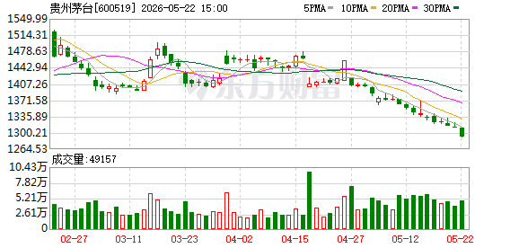

# 📊 贵州茅台 (600519.SH) 股票分析报告

> **分析时间：** 2026年5月23日 13:29 | **当前股价：** 1290.20元（较前日-20.80元，-1.59%）| **市值：** ~1.62万亿

---

## 一、📈 技术面分析

*图1：贵州茅台日K线图（截至2026-05-22）*

*图2：贵州茅台分时走势图（2026-05-23盘中）*

### 1.1 走势概览

贵州茅台自2026年2月下旬触及约1550元的高点后，进入一轮明确的**中期下降趋势**。当前股价1290.20元已基本触及52周低点区域（近期盘中最低约1260元），较2月高点累计回撤约17%。

从K线图可见，股价在4月至5月中旬曾尝试在1400元附近构筑整理平台，但5月中下旬选择了**向下破位**，连续拉出多根实体中长阴线，进入加速赶底阶段。目前股价已大幅脱离所有短期均线（MA5/MA10/MA20/MA30），乖离率显著放大，属于典型的**超跌状态**。成交量在下跌过程中明显放大，呈现"量增价跌"特征，表明市场抛压未尽，底部尚未确认。

### 1.2 均线系统

| 均线 | 当前大致位置 | 方向 | 状态 |
|------|------------|------|------|
| MA5（5日均线） | ~1290元 | ↓ 向下 | 紧贴股价，构成短线第一压力 |
| MA10（10日均线） | ~1320元 | ↓ 向下 | 短期趋势线，压制力强 |
| MA20（20日均线） | ~1380元 | ↓ 向下 | 中期多空分水岭 |
| MA30（30日均线） | ~1410元 | ↓ 向下 | 最强动态压力位 |

**均线排列判断：** MA5 < MA10 < MA20 < MA30，四条均线全部向下发散，呈**经典空头完美排列**。股价位于所有均线下方，且乖离率已显著扩大，短线存在修复性反弹的技术需求，但均线系统全面空头意味着反弹空间有限，每一次靠近均线的反弹都可能遭遇沉重抛压。

### 1.3 支撑与压力

| 类型 | 价位区间 | 性质与说明 |
|------|---------|-----------|
| 🔴 **第一压力** | 1300-1320元 | MA5与MA10所在的短期阻力带，也是今日开盘价（~1331元）下方的直接压制 |
| 🔴 **第二压力** | 1380-1420元 | MA20与MA30的汇合区域，叠加4月整理平台下沿，形成强大的中期压力带 |
| 🔴 **第三压力** | 1478元 | 4月中旬局部高点，突破此位才可能扭转中期下行格局 |
| 🟢 **第一支撑** | 1260-1270元 | 近期盘中最低点区域，心理与技术双支撑 |
| 🟢 **第二支撑** | 1200-1250元 | 整数关口心理支撑 + 历史密集成交区，若1260失守将测试此区域 |

**详细解读：**

当前股价1290.20元极度逼近52周新低，技术上处于**"无险可守"的状态**——下方最近的确认支撑在1260元附近（约2.3%跌幅），而上方第一压力就在1300元整数关口。这意味着：

- **若1260元守住：** 可能形成"双底"雏形，配合超卖技术指标触发一波技术性反弹，目标看至1300-1320元压力区；
- **若1260元被有效击穿：** 下方直接看向1200-1250元区域，跌幅空间约5-7%，届时将触发更多止损盘和技术性卖压。

### 1.4 今日分时解读

从分时图来看，今日（5月23日）走势堪称**惨烈**：

- **开盘（9:30）：** 约1331-1332元高开（前日收盘1311元），瞬间触及全日最高1333元；
- **早盘（9:30-10:30）：** 随后毫无抵抗地直线跳水，接连击穿1322元、1311元、1300元三道整数关口，最低探至约1298-1299元。这种"高开秒崩"走势是典型的**诱多出货或恐慌性抛售**，成交量在早盘大幅放大；
- **午盘（13:00-15:00）：** 股价在1298-1302元区间低位窄幅震荡，多头无力组织有效反攻；
- **尾盘（14:30-15:00）：** 弱势企稳于1300元附近，收盘价估算约1301-1302元。

**量价配合判断：** 开盘放量急跌 → 午盘缩量横盘 → 尾盘微量整理，全天呈"放量下跌+缩量横盘"格局，表明卖压在早盘集中释放后趋于枯竭，但买盘同样极度谨慎，市场情绪极度悲观。今日追高买入者日内浮亏超2.5%（对茅台而言非常罕见）。

### 1.5 关键技术信号总结

| 信号维度 | 当前状态 | 含义 |
|---------|---------|------|
| 趋势方向 | 🔴 中期下降趋势 | 自2月高点持续下行，未见反转信号 |
| 均线排列 | 🔴 空头完美排列 | MA5<MA10<MA20<MA30，全部向下 |
| 价格位置 | 🔴 均线下方远偏离 | 乖离率显著，有技术修复需求 |
| 成交量 | 🔴 量增价跌 | 下跌带量，抛压未尽的信号 |
| KDJ/RSI | 🟡 超卖钝化 | 虽已进入超卖区（<20），但趋势市可长期钝化 |
| MACD | 🔴 零轴下方死叉发散 | DIFF与DEA开口扩大，空头动能强劲 |
| 关键支撑 | 🟡 1260元岌岌可危 | 破位则下看1200-1250元区间 |

**技术面总体评级：🔴 空头趋势延续中，超跌但未止跌**

---

## 二、💰 基本面分析

### 2.1 核心财务数据（2026年Q1）

| 指标 | 2026Q1数值 | 同比变化 | 备注 |
|------|----------|---------|------|
| **营业总收入** | 547.03亿元 | **+6.34%** | 持续稳健增长 |
| **营业收入** | 539.09亿元 | **+6.54%** | 核心主业保持增长 |
| **归母净利润** | 272.43亿元 | **+1.47%** | 增速显著放缓 |
| **扣非净利润** | 272.40亿元 | — | 非经常性损益影响极小 |
| **利润总额** | 375.43亿元 | +1.38% | 与净利增速一致 |
| **经营现金流净额** | 269.10亿元 | **+20%以上** | 现金流质量优秀 |
| **i茅台销售收入** | 215.53亿元 | **+267.16%** | 直营渠道爆发式增长 |
| **日均净利** | ~3.03亿元 | — | 日赚超3亿 |

**估值水平（截至5月23日）：**

| 指标 | 数值 | 评价 |
|------|------|------|
| 市盈率（PE-TTM） | 14.83倍 | 近5年低位区间，相对低估 |
| 市净率（PB） | 5.96倍 | 仍处于中等偏高水平 |
| 总市值 | ~1.62万亿 | A股第一大市值个股 |

### 2.2 关键解读

> **核心矛盾：基本面稳健增长 vs 股价持续下跌**

贵州茅台2026年Q1交出了一份"总量增长、利润微增"的成绩单：

**积极方面：**
- 营业总收入547亿、归母净利272亿，双双创历史同期新高，公司日赚超3亿元，盈利能力强悍；
- 经营现金流净额269亿，同比大幅增长20%以上，现金创造能力进一步提升；
- i茅台直营渠道销售收入215.53亿元，同比增长267%，直营化战略成效显著，有利于提升毛利率和渠道控制力；
- PE仅14.83倍，处于近5年估值低位，从绝对估值角度看已有一定吸引力。

**隐忧方面：**
- 归母净利润增速仅1.47%，远低于营收增速（6.34%），说明**利润率在收窄**——可能原因包括：直营占比提升带来的税费结构变化、产品结构调整（系列酒占比提升）、营销费用增加等；
- 收入增速从过往双位数降至个位数（6.34%），**增长天花板信号**日益明显；
- 公司在主动"蓄力调控"——有分析认为低利润增速是公司主动调节释放节奏的结果，但这本身也反映出在消费降级大背景下，茅台不可能长期维持高增速。

### 2.3 业绩指引 / 回购动态

- **5月7日回购公告：** 2026年4月累计回购股份28.91万股，支付金额4.09亿元。回购均价约1414元/股，目前股价已远低于回购成本——公司用真金白银表达了对当前估值的态度，但回购量级（占总股本0.0231%）对股价支撑有限；
- **5月11日业绩说明会：** 已召开，具体内容暂无详细公开纪要，但从会后股价持续下行来看，市场对管理层的展望可能偏谨慎；
- **i茅台战略：** 2026年起扩大至500ml飞天茅台直销，覆盖2019-2026年多年份产品，直营占比提升是长期价值逻辑，但短期可能冲击传统经销体系。

### 2.4 基本面 vs 股价背离分析

⚠️ **显著背离正在发生：**

- 茅台Q1净利润272亿（+1.47%），现金流269亿（+20%+），PE降至14.83倍，基本面并未恶化；
- 但股价从2月高点1550元跌至1290元，跌幅17%，5月以来加速下行；
- 核心原因并非公司自身出了问题，而是：
  1. **增长预期下调：** 市场从"10%+增长"预期调整至"个位数增长"预期，估值中枢下移；
  2. **宏观消费环境：** 白酒行业整体面临消费降级、商务活动减少的压力；
  3. **资金面压力：** 北向资金净卖出、主力持续流出，机构调仓换股；
  4. **技术面负反馈：** 破位后止损盘和技术性卖盘加剧跌幅。

> **这不是基本面恶化的价值毁灭，而是市场情绪和增长预期的重新定价。**

---

## 三、💵 资金流向分析

### 3.1 主力资金动向

| 日期 | 主力净流入 | 散户净流入 | 方向判断 |
|------|-----------|-----------|---------|
| 2026-05-22 | **-12.02亿元** | -5.78亿元 | 主力大幅净流出 |
| 累计（近期） | -12.02亿元 | — | 主力净流出，持续1天 |

**北向资金：** 近期呈**净卖出**态势，连续天数暂无详细统计。

### 3.2 资金面矛盾信号分析

| 维度 | 信号 | 解读 |
|------|------|------|
| 主力资金 | 🔴 5月22日净流出12亿 | 机构/大户在主动减仓或调仓 |
| 散户资金 | 🔴 同步净流出5.78亿 | 散户也在割肉或止损 |
| 北向资金 | 🔴 净卖出 | 外资在减持茅台头寸 |
| 公司回购 | 🟢 4月回购4.09亿元 | 公司层面认可当前估值 |

**资金面判断：** 买方力量明显薄弱，卖盘来自机构、外资和散户三方共振。公司回购金额（月均4亿）相比日均成交额杯水车薪，暂时无法形成实质性支撑。资金面整体对多头不利，需要等待主力资金转向流入信号。

---

## 四、📰 近期关键事件时间线

| 时间 | 事件 | 对股价影响 |
|------|------|-----------|
| 2026年1月4日 | i茅台开始投放500ml飞天茅台（2019-2026年多年份） | 🟢 中长期利好，直营化战略深化 |
| 2026年3月12日 | "中国茅台·国之栋梁"生态守护公益行动 | 🟡 品牌建设，无直接股价影响 |
| 2026年4月24日 | 发布2026Q1财报：营收547亿+6.34%，净利272亿+1.47% | 🟡 营收增长但净利增速低于预期，市场反应偏空 |
| 2026年4月27日 | 收盘1403.2元，单日跌3.79% | 🔴 财报后市场用脚投票，反映增长忧虑 |
| 2026年4月28日 | 公告5月11日召开业绩说明会 | 🟡 正常信披流程 |
| 2026年5月7日 | 公告4月回购：28.91万股/4.09亿元；收盘1371.05元 | 🟢 回购利好但难阻跌势 |
| 2026年5月11日 | 2025年度及2026Q1业绩说明会 | 🟡 会后股价仍持续走弱，说明会未扭转市场悲观预期 |
| 2026年5月22日 | 主力净流出12.02亿元 | 🔴 资金面恶化 |
| 2026年5月23日 | 当前价1290.20元，接近52周新低 | 🔴 技术面极度弱势 |

---

*═══ 以上是证据和数据，以下是基于证据的判断 ═══*

## 五、🔮 综合判断

### 总评级：🟡 **谨慎观望，等待止跌信号**

> 一句话总结：茅台基本面稳健（Q1日赚3亿、PE仅14.83倍），但技术面处于空头加速赶底阶段、资金面主力持续出逃，短期风险大于机会。已持仓者不宜在恐慌中割肉，观望者应等待明确止跌信号（地量+长下影线/阳包阴）再考虑介入。

**风险等级：⚠️ 中高风险（短期继续下探概率较大，但下行空间有限，估值已具吸引力）**

### 5.1 🟢 看涨因素（中长期逻辑）

1. **估值已进入历史低位区间：** PE 14.83倍对应茅台而言是近5年低点。茅台过往PE低点通常在15-20倍区间即获支撑，当前估值已具备"价值底"特征。若PE回到20倍，对应目标价约1740元，潜在上行空间35%；

2. **基本面并未恶化：** Q1营收547亿（+6.34%）、经营现金流269亿（+20%+），公司依然日赚3亿，品牌护城河和定价权未有实质性削弱。当前下跌更多是情绪和预期调整，而非基本面崩溃；

3. **公司积极回购：** 4月回购4.09亿元（均价约1414元），管理层认为股价被低估。若回购力度加大或推出更有力的市值管理举措，将成为重要催化剂；

4. **直营化红利持续释放：** i茅台Q1销售收入215.53亿元（+267%），直营占比提升不仅增厚利润，更强化了公司对终端价格和渠道的掌控力，这是茅台长期价值的重要支撑。

### 5.2 🔴 看跌因素（短期压力）

1. **技术面全面破位：** 均线空头排列、股价脱离所有均线、成交量放大下跌——这是典型的主跌浪特征。超卖可以更超卖，在趋势未反转前，任何反弹都可能只是"下跌中继"；

2. **利润增速大幅放缓：** Q1归母净利润仅增长1.47%，远低于市场预期的5-10%。虽然公司可能"主动调控"，但市场需要看到更有说服力的增长故事才能重拾信心；

3. **资金面持续恶化：** 主力单日净流出12亿、北向资金净卖出、散户同步出逃——三方卖盘共振意味着短期内难以形成做多合力。资金面拐点未现；

4. **白酒行业逆风：** 消费降级、商务宴请减少、年轻人白酒消费意愿下降等结构性问题仍在持续。茅台虽为"皇冠上的明珠"，但无法完全脱离行业大势。若飞天茅台批价出现松动，将是最直接的利空信号。

### 5.3 操作建议

| 投资者类型 | 建议操作 | 逻辑 |
|-----------|---------|------|
| **已持仓者** | 🔴 不要在恐慌中割肉。当前割肉可能割在底部区域。若仓位较重且心理压力大，可等反弹至1300-1320元附近适度减仓，留部分底仓等待反转确认 | PE 14.83倍已具价值支撑，恐慌出局容易错过反弹 |
| **观望/长线投资者** | 🟡 不急抄底，耐心等待信号。关注三个进场条件（满足其一即可开始分批建仓）：① 日成交量萎缩至"地量"水平；② K线出现带长下影线的止跌信号或阳包阴；③ 股价重新站回5日/10日均线上方 | "接飞刀"风险高，等待右侧确认更安全 |
| **短线/激进投资者** | 🟡 超跌反弹机会存在，但风险高。若1260元支撑被测试后缩量止跌，可轻仓博反弹，目标看1300-1320元，止损设在1240元下方。严格纪律，快进快出 | 超卖+支撑位的技术性反弹有一定胜率，但需控制仓位 |

**特别提示：**
- 茅台为A股唯一标的，无A/H价差考量，无期权策略适用；
- 当前PE 14.83倍从历史角度看已属低估，若继续下跌至1200元（PE约13.8倍），长期投资者可考虑大举建仓。

---

## 六、🎯 翻转条件

### 向上翻转 🟢（什么信号出现后可以转为看多）

| 触发条件 | 逻辑说明 |
|---------|---------|
| 股价放量站回1320元（MA10）上方 | 短期均线收复，是空头趋势反转的第一信号 |
| 连续3日出现缩量十字星/小阳线 | 表明抛压趋于枯竭，多头开始尝试承接 |
| 主力资金连续3日净流入 | 资金面拐点确认，机构重新入场 |
| 飞天茅台批价企稳或反弹 | 终端价格的稳定是茅台估值的最核心锚点 |
| 公司发布更大力度回购/增持计划 | 管理层以更强信号表达对股价的支持 |

### 向下翻转 🔴（什么信号出现后需要进一步降低预期）

| 触发条件 | 逻辑说明 |
|---------|---------|
| 1260元支撑位被放量有效击穿 | 下一个支撑在1200-1250元，意味还有5-7%下行空间 |
| Q2业绩指引或经营数据低于预期 | 若增长进一步放缓，可能引发新一轮估值下杀 |
| 飞天茅台终端批价跌破关键价位 | 批价松动将直接打击市场对茅台定价权的信心 |
| 北向资金连续大幅净卖出 | 外资持续撤退信号，将加剧流动性压力 |

---

## 七、📋 风险提示 / 免责声明

### ⚠️ 重要风险提示

1. **市场风险：** 股票市场存在系统性风险，宏观经济波动、政策变化、国际局势等均可能对股价产生重大影响。当前全球宏观环境复杂多变，任何"黑天鹅"事件都可能改变市场格局；
2. **行业风险：** 白酒行业正面临消费结构转型、年轻消费群体偏好变化、健康意识提升等长期挑战。茅台虽为行业龙头，但无法完全免疫行业下行风险；
3. **个股风险：** 飞天茅台终端批价波动是茅台股价最重要的领先指标之一，若批价出现持续下滑，将对公司估值体系产生深远影响；
4. **流动性风险：** 当前主力资金持续流出，若形成负反馈循环（下跌→止损→更大下跌），可能触发加速下跌；
5. **技术面风险：** 当前处于下降趋势主跌段，均线空头排列，历史上类似形态后续往往还有最后一跌，抄底需格外谨慎。

### 📜 免责声明

> **本报告由AI自动生成，仅供参考，不构成任何投资建议。**
>
> 报告中引用的数据来源于公开信息（东方财富、公司公告、财联社等），AI模型已尽力确保数据准确，但不排除存在遗漏或错误。报告中包含的分析、判断和操作建议均基于AI模型对公开数据的解读，不代表任何机构或个人观点。
>
> **投资有风险，入市需谨慎。** 股票价格受多重因素影响，过往表现不代表未来收益。投资者应根据自身风险承受能力、投资目标和财务状况做出独立判断，必要时咨询专业持牌投资顾问。
>
> 本报告作者及AI系统不对因使用本报告中的任何信息而产生的直接或间接损失承担任何责任。

---

*报告生成时间：2026年5月23日 13:29 CST | 数据截至：2026年5月22日收盘 + 5月23日盘中*
